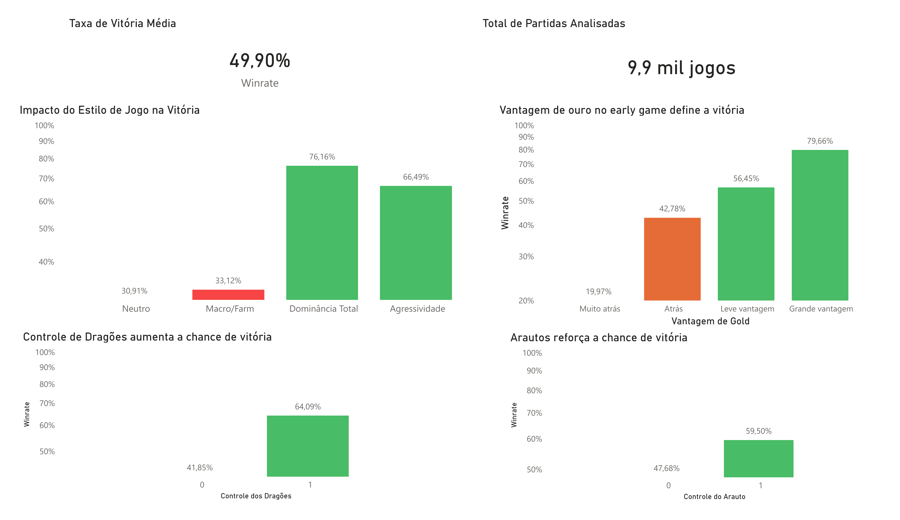

# Data Analysis - League of Legends (Early Game)

This project aims to analyze early game factors (first 10 minutes)
that influence victory in ranked League of Legends matches.

The analysis was conducted using R, SQL, and Power BI, exploring match data
to identify patterns and relationships between performance and final outcomes.

## Objective

To identify which factors in the first 10 minutes of the game have the greatest impact
on the probability of winning ranked League of Legends matches.

## 📊 Technologies Used

- R (exploratory data analysis)
- SQL (queries and validation)
- Power BI (visualization and dashboard)

## 📁 Dataset

The dataset contains information from ranked matches,
focusing on the first 10 minutes of the game, including:

- Total gold
- Kills
- Dragons
- Rift Herald
- Towers
- Farm (CS)

## 🧹 Data Processing

The project uses two versions of the dataset:

- **Raw data (`data/raw/ranked_10min_nao_tratado.csv`)**: original dataset without modifications.
- **Processed data (`data/processed/ranked_10min_tratado.csv`)**: version after cleaning and transformation performed in R.

The data processing includes:
- Data type adjustments
- Creation of derived variables (e.g., gold difference, kills, and objectives)
- Organization of data for analysis and visualization

This separation helps maintain the integrity of the original data and ensures reproducibility of the analysis process.

## 📈 Key Insights

- Gold advantage in the early game is the factor most strongly associated with victory.
- Teams with simultaneous advantages in kills and farm have the highest win rate (~77%).
- Control of objectives such as dragons and Rift Herald significantly increases the chances of winning.
- Isolated farm advantage does not guarantee success, requiring conversion into in-game pressure.

## 📊 Dashboard

Visualization of the main insights obtained in the analysis:

## Conclusion

The results indicate that victory is strongly related to the ability
to generate an advantage in the early game and convert it into pressure.

The combination of economic factors (gold and farm) and strategic factors (kills and objectives)
proves to be decisive for team success.
